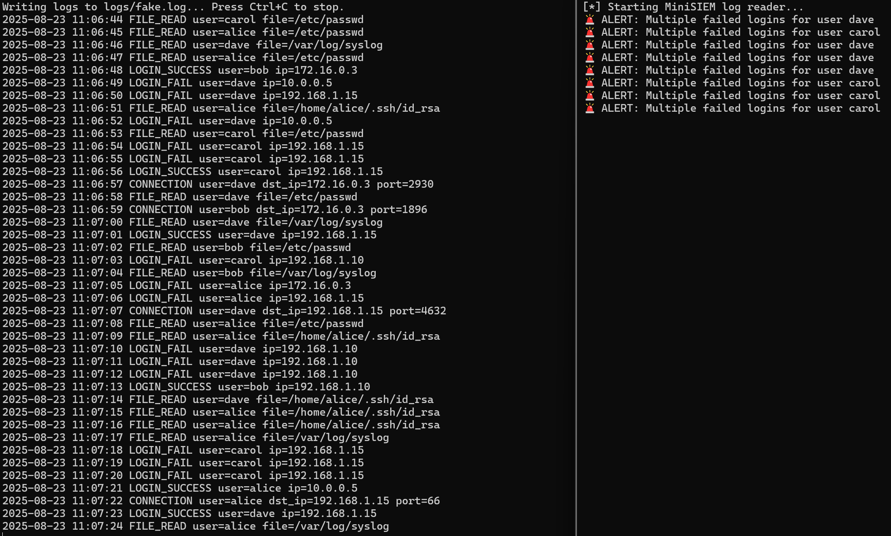

# MiniSIEM  

A lightweight log analysis tool inspired by Splunk.  
Built for learning SIEM concepts while experimenting with Python.  

## Features  
- Collects and stores simulated Windows event logs (JSON/CSV)  
- Basic log search and filtering  
- Alerting rules (e.g., repeated failed logins)  
- Minimal visualization (counts, graphs)  

## Why MiniSIEM?  
This project is designed as a learning exercise to:  
- Understand how SIEM systems like Splunk work under the hood  
- Practice Python, log parsing, and data analysis  
- Build a portfolio-ready project in cybersecurity  

## Screenshot  
Below is an example of MiniSIEM detecting failed logins using the log generator:  

  

## Usage  
1. Start the log generator:  
   python log_generator.py  

2. Run the MiniSIEM analyzer:  
   python minisiem.py  

3. Logs will be processed and alerts will be displayed in the terminal.  

## Roadmap  
- [x] Log generator (failed/successful login events)  
- [x] Basic alerting rules (failed login detection)  
- [ ] Expanded anomaly detection (brute force, unusual activity)  
- [ ] Visualization with matplotlib  

---  

⚡ Work in Progress. Stay tuned!  